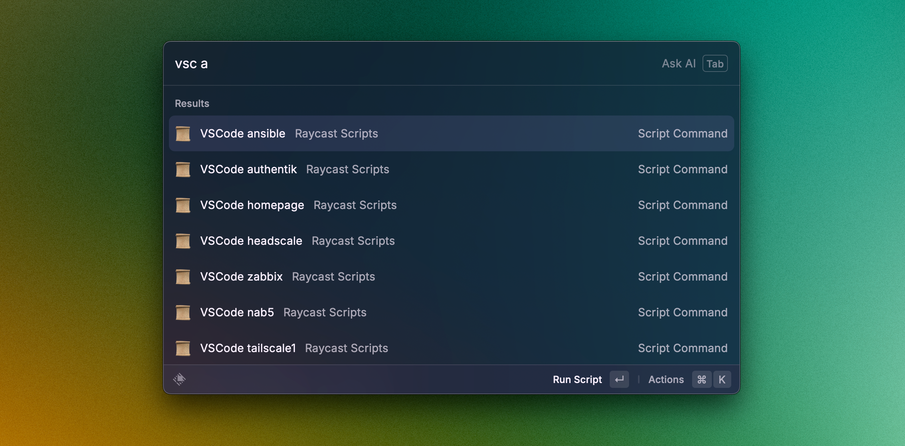

# Ansible Role: Raycast Hosts Editor

This Ansible role creates VSCode (or compatible editor like Windsurf) Raycast scripts for remote hosts. It generates scripts that allow you to quickly open VSCode connected to remote hosts via SSH using Raycast on macOS.

## Features

- Generate a script for each host of the inventory.  
- It can be configured with a custom editor.  
- The path of the Raycast script can be configured.  

## Screenshot


## Requirements

- Ansible 2.9 or higher
- Raycast installed on the target macOS system
- Visual Studio Code or compatible editor with Remote SSH extension installed
- SSH access configured between the target macOS system and the remote hosts

## Role Variables

```yaml
# Required variables
user: "username"                          # The username on the target macOS system
host: "hostname"                          # The hostname of the target macOS system
home: "/Users/username/"                  # The home directory on the target macOS system

# Lists of host information
dev_hostnames: []                         # List of remote hostnames
dev_alias: []                             # List of aliases for the remote hosts
dev_vspaths: []                           # List of paths to open in editor for each host
dev_ansible_ssh_users: []                 # List of SSH users for connecting to each host

# Optional variables with defaults
raycast_scripts_path: ".raycast/scripts"  # Path to Raycast scripts directory relative to home
editor_name: "VSCode"                     # Name of the editor to use in script titles
editor_path: "code"                       # Command to launch the editor
editor_alias: "vs"                        # Prefix for script filenames
```

## Dependencies

No dependencies on other roles.

## Example Playbook

```yaml
- name: Create Raycast scripts for remote hosts
  hosts: localhost
  gather_facts: false
  vars:
    management_user: "you"
    management_host: "your-mac"
    management_home: "/Users/you/"
  tasks:
    - name: Include raycast editor host role
      include_role:
        name: ansible-role-raycast-hosts-editor
      vars:
        dev_hostnames: "{{ dev_hostnames }}"
        dev_alias: "{{ dev_alias }}"
        dev_vspaths: "{{ dev_vspaths }}"
        dev_ansible_ssh_users: "{{ dev_ansible_ssh_user }}"
        user: "{{ management_user }}"
        host: "{{ management_host }}"
        home: "{{ management_home }}"
```

## Testing

The role includes a test playbook and inventory that can be used to verify functionality. To run the tests:

```bash
cd ansible-role-raycast-hosts-editor
ansible-playbook -i tests/inventory.ini tests/test.yml
```

The test creates Raycast scripts in a temporary directory (`~/tmp/raycast/scripts`) to avoid modifying your actual Raycast scripts during testing.

## Inventory Example

Here's an example inventory file format that works with this role:

```ini
[all]
ansible     ansible_host="192.168.1.10"   alias="a"     vspath="/home/ansible/ansible"
docker      ansible_host="192.168.1.11"   alias="d"     vspath="/data/docker"
homepage    ansible_host="192.168.1.12"   alias="hp"    vspath="/opt/homepage/config"

[all:vars]
ansible_user="ansible"
```

When using this inventory format, you can extract the values dynamically in your playbook:

```yaml
dev_hostnames: "{{ groups['all'] | difference(['localhost']) }}"
dev_alias: []  # Will be populated from inventory
dev_vspaths: []  # Will be populated from inventory
dev_ansible_ssh_users: []  # Will be populated from inventory

pre_tasks:
  - name: Set aliases from inventory
    set_fact:
      dev_alias: "{{ dev_alias + [hostvars[item].alias | default(item)] }}"
    loop: "{{ dev_hostnames }}"
    
  - name: Set vspaths from inventory
    set_fact:
      dev_vspaths: "{{ dev_vspaths + [hostvars[item].vspath | default('/home/' + hostvars[item].ansible_user + '/')] }}"
    loop: "{{ dev_hostnames }}"
    
  - name: Set SSH users from inventory
    set_fact:
      dev_ansible_ssh_users: "{{ dev_ansible_ssh_users + [hostvars[item].ansible_user | default('ansible')] }}"
    loop: "{{ dev_hostnames }}"
```

## License

MIT

## Contributing

Contributions are welcome! Please feel free to submit a Pull Request.

1. Fork the repository
2. Create your feature branch (`git checkout -b feature/amazing-feature`)
3. Commit your changes (`git commit -m 'Add some amazing feature'`)
4. Push to the branch (`git push origin feature/amazing-feature`)
5. Open a Pull Request

## Author Information

- Lucas Janin
- https://lucasjanin.com
- https://mastodon.social/@lucas3d
